- [配置环境](#配置环境)
- [作业1](#作业1)
- [作业2](#作业2)
- [作业3](#作业3)
- [作业4](#作业4)
- [作业5](#作业5)

## 配置环境
**配置busybox**
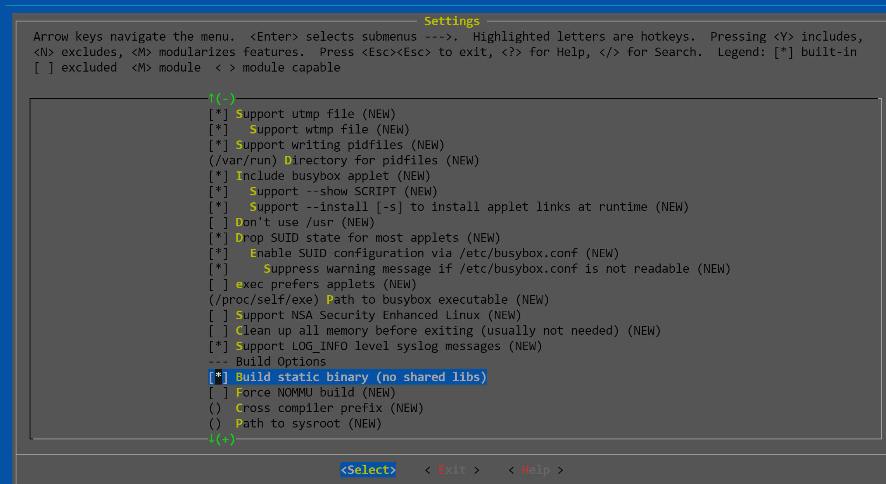

**make install -j$(nproc)**
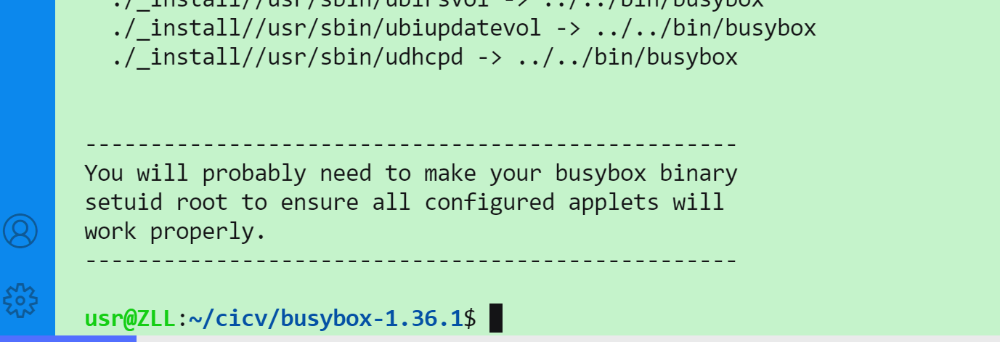

**安装qemu**

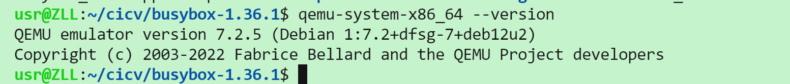

**配置Linux文件夹**
**安装bindgen工具**


**make LLVM=1 rustavailable**
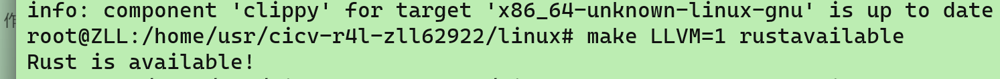

## 作业1
**编译Linux内核 make x86_64_defconfig**


**make LLVM=1 menuconfig**
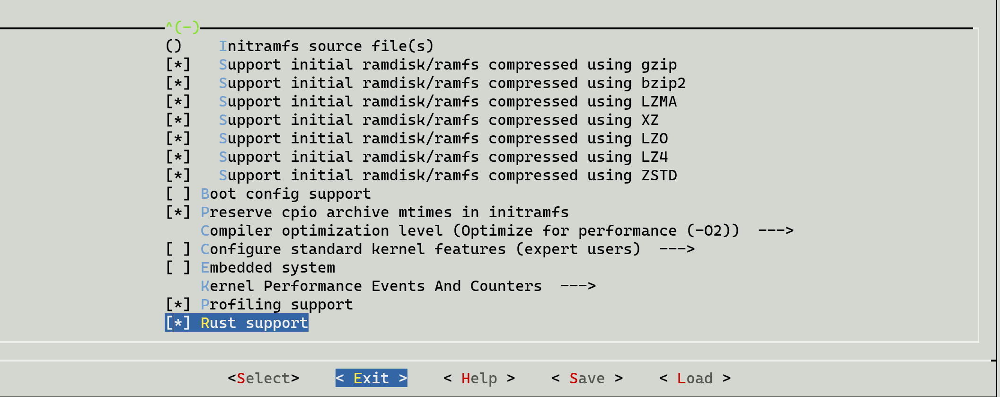

**make LLVM=1 -j$(nproc)**


**得到vmlinux文件夹**


## 作业2
```
问题1：
Kbuild文件里的obj-m := r4l_e1000_demo.o  
问题2：
Makefile中通过-C指定linux内核位置，而M=$(PWD)指定驱动源码位置。内核顶层的Makefile检查到M非空时，会编译该模块为外部module。
```
- **禁用默认的网卡：**
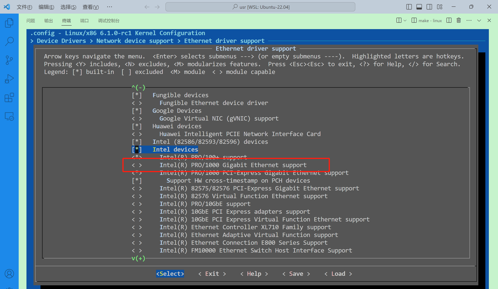

- **重新编译内核：**
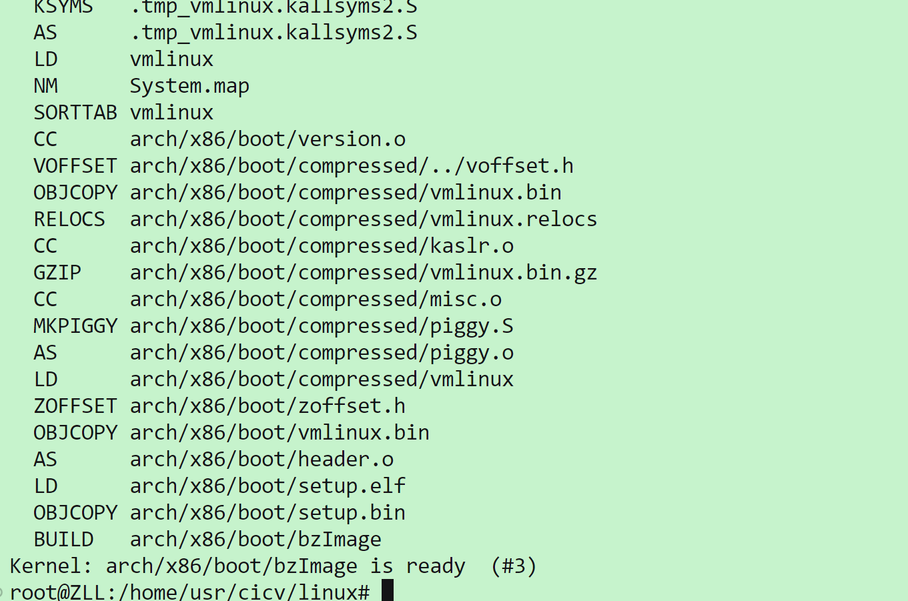

- **编译e1000网卡**


- **运行脚本，加载e1000网卡**
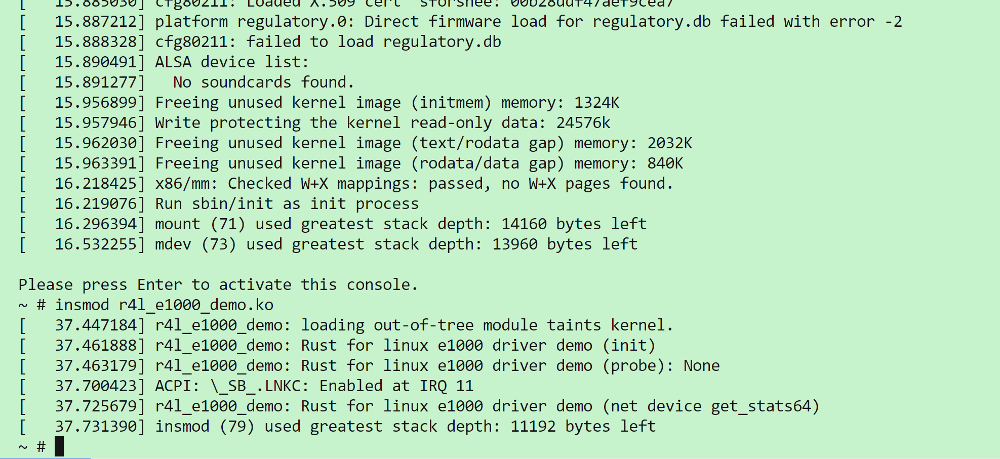

- **配置该网卡**
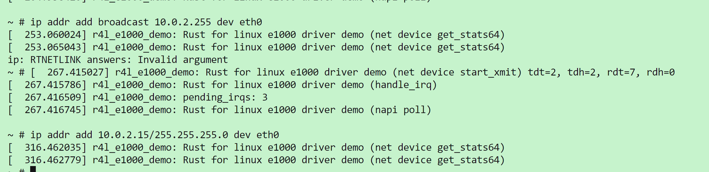

- **测试是否成功**
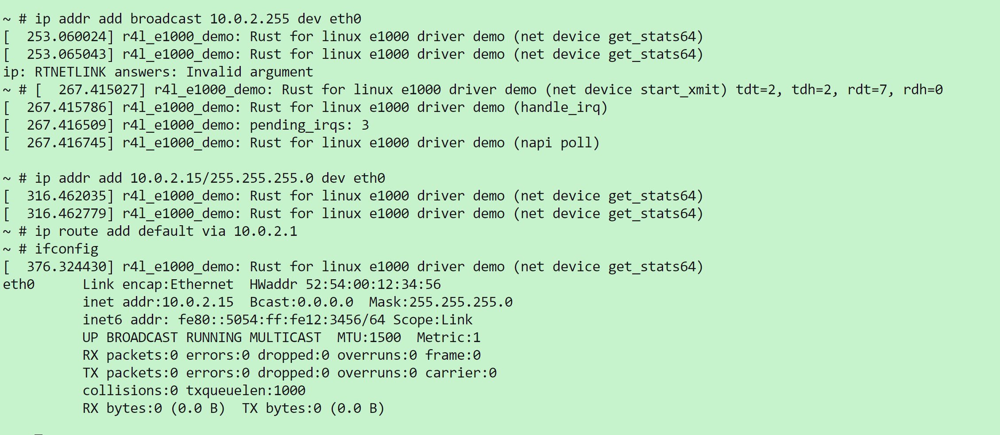
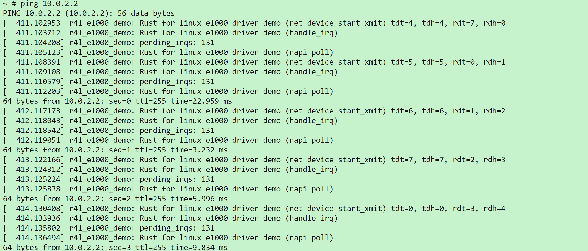

## 作业3

- **进入linux/samples/rust，新建文件**
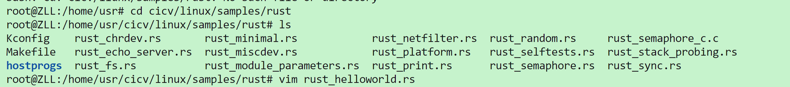
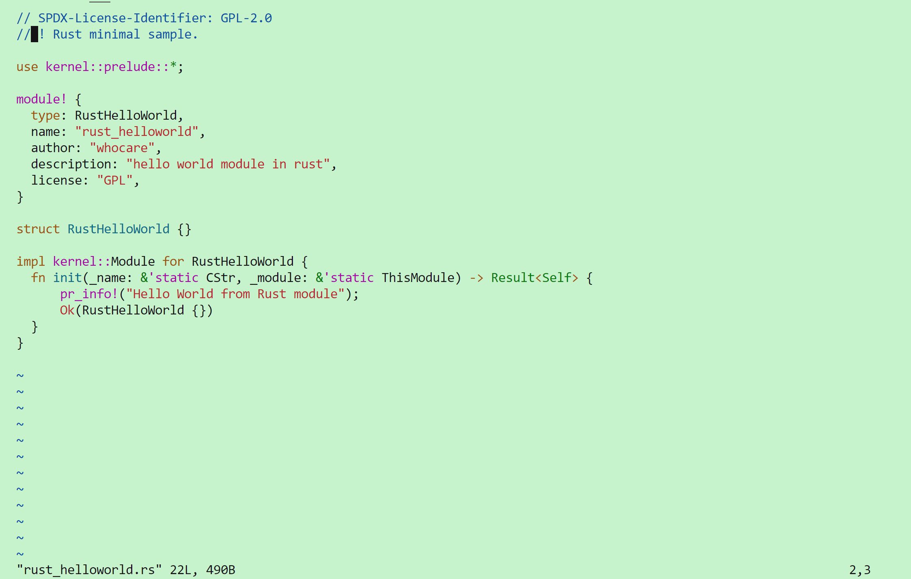

- **编辑Kconfig**
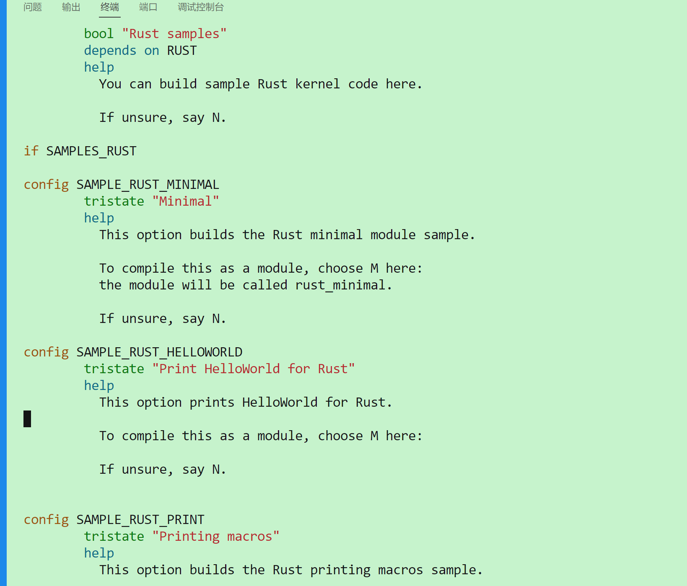
- **编辑Makefile**  
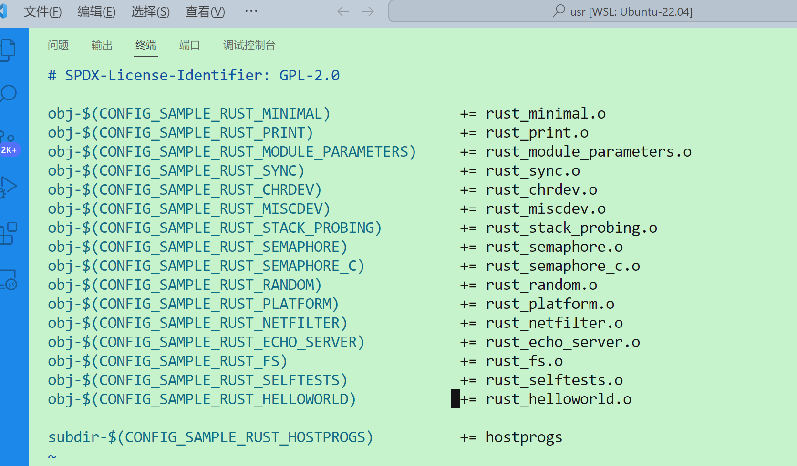
- **到linux文件夹，更改该模块的配置，使之编译成模块**
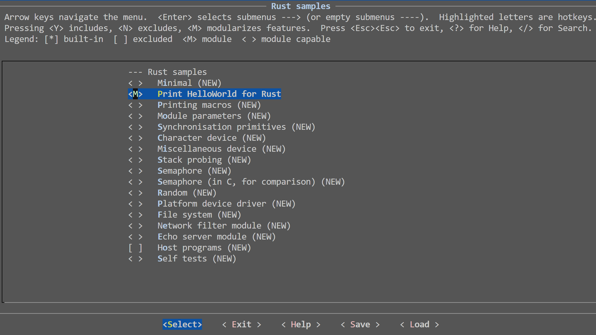
- **重新编译内核**
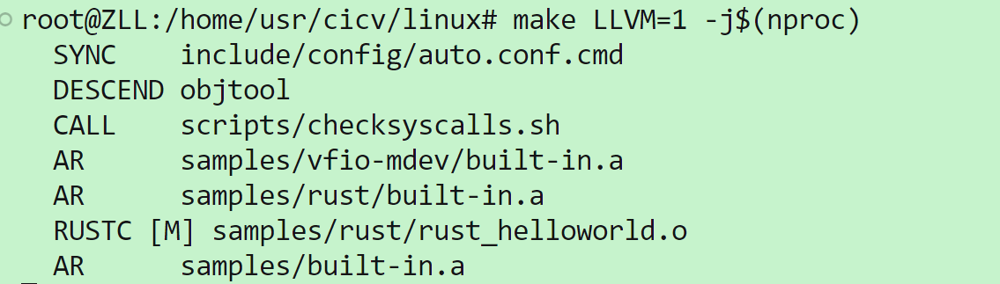
- **将在linux/samples/rust下生成的rust_helloworld.ko复制到src_e1000/rootfs,并运行build_images.sh**

- **可以找到rust_helloworld.ko,并执行insmod rust_helloworld.ko**
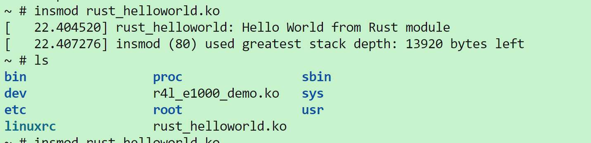

## 作业4

## 作业5
- 修改rust_chrdev.rs文件
- 更改配置
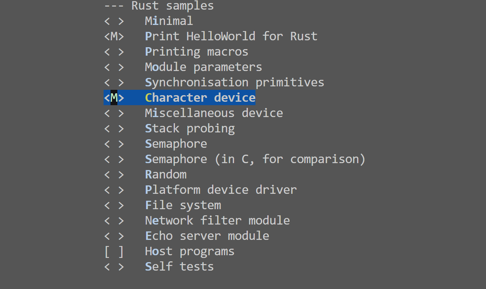
- 重新编译
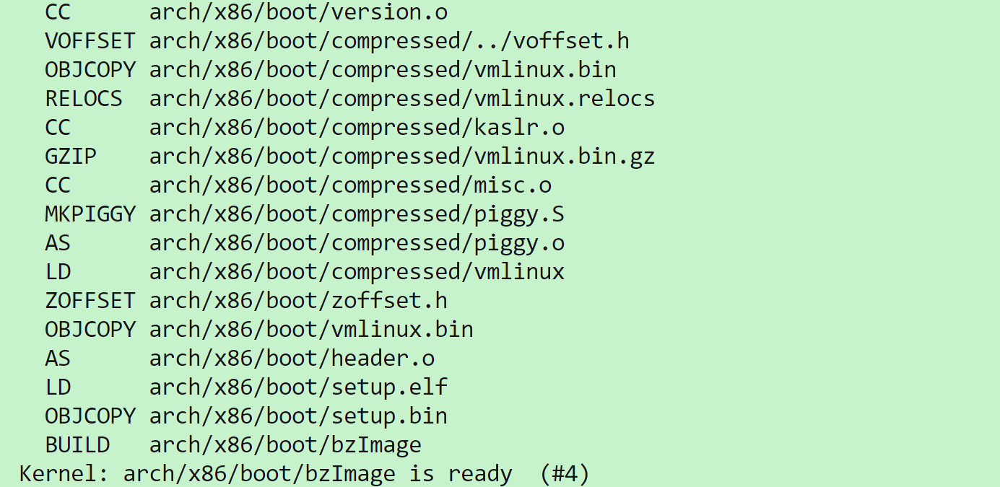
- 测试是否成功
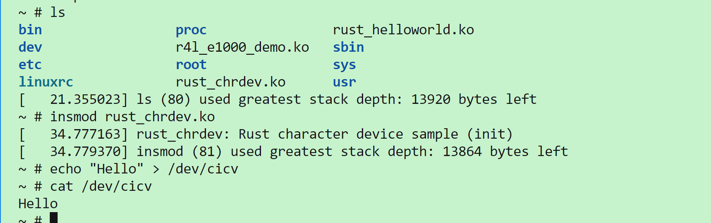


